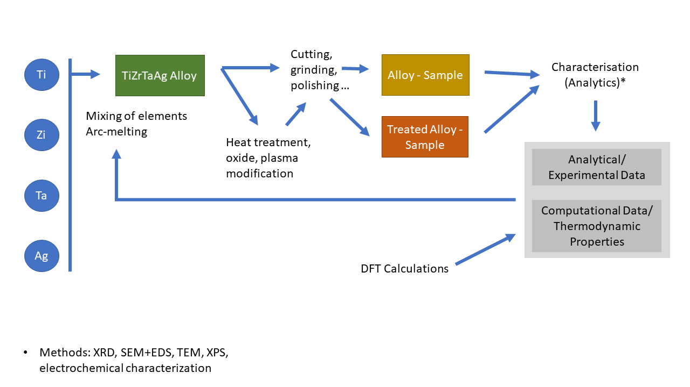
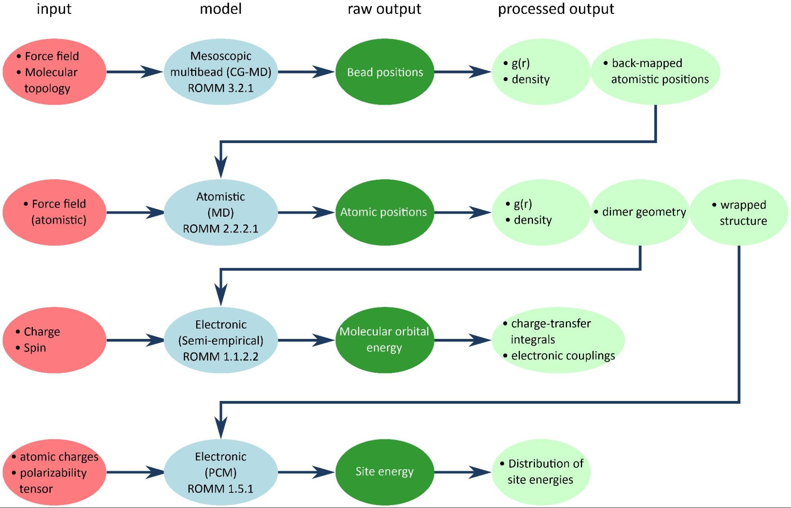
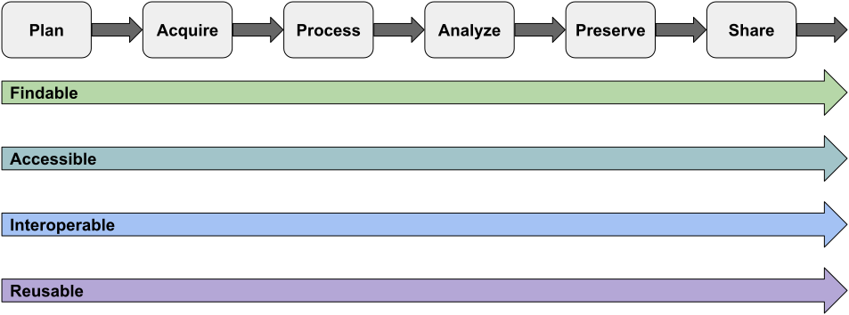
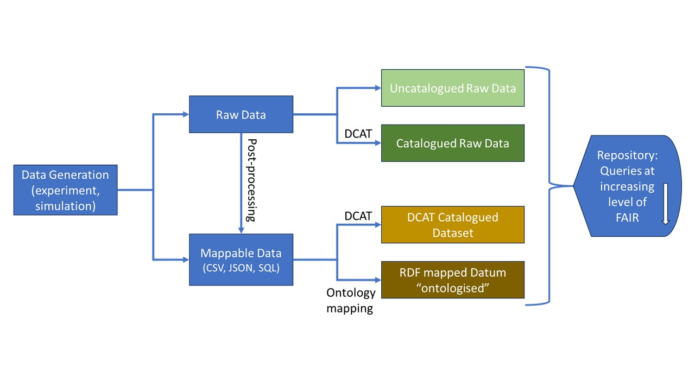

# Field Guide for Increasing the FAIR Maturity of Materials and Chemistry Data

Developed by Harmonised Terminologies and Schemas for FAIR Data in Materials Science and Related Domains Working Group

[Group Homepage](https://www.rd-alliance.org/groups/harmonised-terminologies-and-schemas-fair-data-materials-science-and-related-domains-wg/activity/)

## Executive summary

The FAIR data principles present an aspirational set of foundational principles—Findability, Accessibility, Interoperability, and Reusability—that guide data producers as they work to improve the machine actionability of their data and metadata. The FAIR data principles do not explicitly define a set of actions to increase FAIR maturity of a digital object. Instead, they describe a continuum of features, attributes, and behaviors that move a digital resource closer to that goal \[[FAIR](https://doi.org/10.1038/sdata.2016.18), [FAIRmaturity](https://doi.org/10.1038/s41597-019-0184-5)\].

While there has been a tremendous amount of effort within and beyond RDA to provide clearly defined pathways to improve and assess FAIR maturity, the materials and chemistry communities have lagged behind other scientific and engineering disciplines. This is likely also due to the extraordinary complexity of these disciplines. The discovery of new materials involves understanding and harnessing the pairwise relationships between process-structure-properties-performance ([PSPP](https://www.google.com/url?sa=t&source=web&rct=j&opi=89978449&url=https://repository.gatech.edu/server/api/core/bitstreams/238153d9-9592-48b0-bc75-8e3f7ca12948/content&ved=2ahUKEwjy5Li3juWRAxXogP0HHTD7EXAQFnoECBoQAQ&usg=AOvVaw1AOJkq3yfZEqHk_D40fq0R)). Interesting phenomena span more than 10 orders of magnitude in both space and time, and material phenomena can be explored both computationally and experimentally. Moreover, the existing resources for FAIR data management are scattered and poorly interoperable/interoperating. This document serves as a practical field guide for data stewards who are supporting professionals within the materials and chemistries disciplines.

## Objectives

This document seeks to provide practical recommendations to help improve the FAIR maturity of data produced within the materials and chemistry disciplines using existing semantic artefacts and other tools and services for FAIR data management.

## Target audience

This document targets individuals working in a data stewardship role, supporting other individuals within the discipline of materials and chemistry. The information is also beneficial for data curators and data producers.

- *comment below on personas, would this be helpful here to describe these roles that may be directly interested in semantic artifacts?*

## Use case examples of common research procedures

### Example of the complexity of experimental procedures in materials science and engineering domain

*Case 1\. High Entropy Alloy Fabrication, Analysis and Adaptation for BioSensors or Medical Surfaces*

- Pure elements are melted (arc-melting) and an alloy is fabricated. Next processing steps are cutting, grinding, and polishing. Further treatments (e.g. high-temp. heating, plasma, oxygen) can be applied.
- The intermediate and treated products are characterised using a panel of methods: for example, XRD, SEM \+ EDS, TEM, XPS, Raman spectroscopy, electrochemistry).
- In parallel, preferences of element bonding in the structures (thermodynamic properties derived from parametric approaches) are calculated using DFT calculations.
- In the follow up applications, biocompatibility or antifouling properties are tested.

**Figure 1:** A graphical representation of an experimental workflow for high entropy alloy fabrication, analysis and adaptation for biosensors or medical surfaces.

### Example of the complexity of computational procedures in materials science and engineering domain

*Multiscale simulations of amorphous-matrix organic semiconductors. DOI: [10.1021/acs.jpcc.2c08862](https://doi.org/10.1021/acs.jpcc.2c08862)*

[MODA](https://emmc.eu/moda-chada/moda/) diagram of the computational procedure described in the text below.

- The organic semiconductor is assumed to be composed of "small" molecules, i.e. whose molecular weight can be accurately predicted from their stoichiometric formula. The individual molecule forms the building block of the computational procedure.
- The gas-phase minimum energy structure, partial atomic charges, polarizability tensor, and torsional degrees of freedom are computed with an electronic-structure model (also called *ab-inito*), e.g. at the DFT level of theory.
- An atomic force-field is optimised to accurately reproduce the molecular geometry and inter-molecular forces, using electronic-structure calculations as a reference.
- A coarse-grained force-field is modelled to accurately reproduce the molecular geometry and inter-molecular forces using the atomic force field as a reference.
- An amorphous sample of the organic semiconductor is created at the coarse-grained level of theory. This step involves creating a low-density initial guess of the sample, which is compressed to the target density and then annealed at the target temperature while simultaneously equilibrating the pressure at the target value. Density, radial distribution functions, and other solid-state properties are computed on the equilibrated samples.
- The coarse-grained sample is back-mapped to atomic coordinates.
- The back-mapped atomic sample is minimised and then annealed at the same thermodynamic variables.
- Couples of adjacent molecules are identified based on the distance between their centre-of-mass. Electronic-structure calculations are performed for every couple.
- The HOMO and LUMO levels, electron mobility, and energetic disorder are computed using the atomic coordinates from the atomistic sample and electronic properties from ab-initio calculations.

**Figure 2:** A graphical representation of multiscale simulations.

## Semantic Artefacts and the Data Lifecycle

The adoption of the FAIR data principles is indeed a sophisticated process and can seem overwhelming to community members. The FAIR principles themselves constitute 15 discrete principles grouped within the concepts of findable, accessible, interoperable, and reusable. In order to help guide the reader, we present the FAIR principles and the use of semantic technology through the context of the data lifecycle presented in \[[The United States Geological Survey Science Data Lifecycle Model](https://doi.org/10.3133/ofr20131265)\].

**Figure 3:** A data lifecycle model shown with crosscutting concerns of the FAIR data principles.

As common for semantic artefacts, the implementation of their usage in existing standards is required at different levels, ranging from the file’s data arrangement over repository databases to global technologies (e.g., knowledge graphs), to unfold full functionality. With regard to knowledge representations of materials, during the data lifecycle various levels of abstraction are applicable, such as classification systems of materials or semantic assets for a particular sample. Since the sample description is crucial metadata in many scientific fields, the use of semantic technologies would significantly affect the data lifecycle and improve the FAIRness of the produced data. Orthogonal to the complexity of the FAIR principles resides the complexity of the materials science and chemistry communities.

## Recommendations

Below we present a comprehensive field guide for data support staff (e.g., data stewards, data curators, repository managers, tool & workflow developers, etc.), with a renewed emphasis on the FAIR data principles and the use of existing semantic artefacts or their development in case appropriate semantic artefacts are missing.

### Plan

The planning stage of the data lifecycle occurs before any new data is created. However, in material science the sample is a key component of the envisioned project and its characteristics can affect the creation of new data. In this stage of the data lifecycle, researchers are generally expected to develop a data management plan, find previously published data that is relevant to the new project, take steps to support the FAIR data principles, and acquire any necessary equipment, software, and supplies. This section aims to provide support for these steps.

#### Data Management Plan

A Data Management Plan (DMP) is a formal document that outlines how data will be handled throughout the lifecycle of a research project or initiative. It describes the strategies and procedures for collecting, organizing, documenting, storing, sharing, protecting, and preserving data. It is recommended that the use of semantic artefacts, such as controlled vocabularies, taxonomies, ontologies, and metadata schemas, be defined/declared in a DMP. It is recommended that researchers search for existing semantic artefacts that can be used to classify the sample. If no appropriate semantic artefacts exist and bandwidth permits, it is recommended that data stewards help organise working groups to develop appropriate semantic artefacts. FAIR Implementation Profiles (FIPs) represent FAIR implementation strategies and contain information about standards, semantic artefacts and services recommended for a specific purpose. FIPs should take sample characteristics into account and should be used to complete DMPs and to improve interoperability of the produced data.

**Recommended resources for data management plans:**

- [Data Stewardship Wizard](https://ds-wizard.org/)
- [DMPonline](https://dmponline.dcc.ac.uk/)
- [FAIR Implementation Profiles](https://www.go-fair.org/how-to-go-fair/fair-implementation-profile/)
- [FIP Mini-Questionnaire](https://docs.google.com/spreadsheets/d/1yx8r2St6ha-lmQtg02Fvwu8nB21uWiTOM8tLIgJ70oE/edit?gid=127295437#gid=127295437)
- [Dataspecer](https://dataspecer.com/) (a tool for the development of semantic artefacts)

Having a clear plan for the overall organisation of data organisation is helpful in carrying out data management and taking the relevant actions in each of the steps in the data lifecycle. Here is an overview of the potential flow from generation of data by experiment and simulation on the left to finding (via certain types of queries) data on the right. It becomes clear that the intermediate steps taken put limitations on the level of findability and interoperability, and reusability of data. Clearly, raw data that are not catalogued with relevant metadata lack FAIRness. Also, unless the actual data have been processed to certain standards and mapped using a common semantic reference (see Interoperability indicators in Stream A), it will not be possible to run coherent queries across different datasets, i.e. the query would require first fetching whole datasets, then carrying out further data wrangling to produce a coherent result.

**Figure 4:** A graphical representation of data flows resulting in increased levels of FAIR matruity.

#### Finding Data

New experiments (or computational modelling) usually build on existing knowledge or data. In the planning stage, it is important to collect all available information, data and tools to avoid reinvention of a wheel. This includes the history of a specific sample (e. g. former measurements) and data produced from related samples. It is also important to register all resources used in the planned research, including their GUPRIs (also known as PIDs) \- see also Provenance.

**Recommended resources for finding data:**

- [Google Dataset Search](https://datasetsearch.research.google.com/)
- [EOSC EU Node](https://open-science-cloud.ec.europa.eu/resources/all)
- [Zenodo](https://zenodo.org/)
- [MaterialsCloud](https://www.materialscloud.org/discover/menu)
- [PSDI Cross Data Search](https://data-search.psdi.ac.uk/)
- [Explorer of Data Repositories](https://data-collections.nfdi4ing.de/explorer/) maintained by NFDI4Ing

#### Searching for Existing Semantic Assets

As discussed in the DMP section, it is best to consider the FAIR data principles early in the data lifecycle.

**Recommended resources to search for existing semantic assets:**

Existing semantic assets can be found in a number of ways including web search or visiting one of the following maintained resources:

- FAIRSharing, including [https://fairsharing.org/3512](https://fairsharing.org/3512)
- Portals
- Terminology Services: [https://terminology.nfdi4chem.de](https://terminology.nfdi4chem.de) , [https://terminology.nfdi4ing.de](https://terminology.nfdi4ing.de)
- [Ontology Lookup Service](https://www.ebi.ac.uk/ols4/)

You may also wish to contact an expert. These long-standing organisations can help with this:

- RDA Materials IG
- MaRDA
- Asian Materials Data Committee
- [EMMC](https://emmc.eu)

Another source of existing semantic artefacts can be discipline- or process-oriented [FIPs](https://www.go-fair.org/how-to-go-fair/fair-implementation-profile/) (see section Data Management Plan).

In case, there are no appropriate existing data, data stewards should organise working groups to develop appropriate semantic artefacts. Use recommendations described in Stream A to ensure FAIRness of the developed semantic artefacts.

#### Creating Data Dictionaries

For terms or concepts not defined in an existing semantic asset, one of the simplest actions recommended is creating a data dictionary. A data dictionary typically includes details such as the names of data fields, data types (e.g., text, integer, date), allowable values (e.g., ranges, enumerations, or codes), definitions of each field, relationships between data elements, and any constraints or rules applied to the data.

**Recommended resources for creating data dictionaries:**

- contributions requested

#### Physical Samples

Unique identifiers for physical samples are essential for ensuring accurate tracking, management, and later reuse of the data produced. While it is convenient for researchers to use locally unique identifiers, globally unique identifiers will enable global reuse. In addition to developing a plan for sample identification, it’s recommended that the full processing history of the sample be captured in a machine-actionable format. While some domains, such as additive manufacturing, have established semantic assets, this represents an underdeveloped part of the materials community.

**Recommended resources for managing physical samples:**

- [RDA Sample Type Classification WG](http://www.rd-alliance.org/groups/sample-type-classification-wg)
- International Generic Sample Number (IGSN), [https://ev.igsn.org/about-igsns](https://ev.igsn.org/about-igsns)

#### Research Code

A significant number of efforts are focused on the intersection of the FAIR data principles and research code. Thus, there are semantic assets and recommendations that can be leveraged early in the data lifecycle:

**Recommended resources for research code:**

- FAIR Principles for Research Software [https://doi.org/10.15497/RDA00068](https://doi.org/10.15497/RDA00068)
- The CodeMeta Project [https://codemeta.github.io/](https://codemeta.github.io/)
- [Software Sustainability Institute Resources Hub](https://www.software.ac.uk/resource-hub)

#### Equipment/Instruments

If new equipment is being purchased, this is an opportunity to include machine actionability in the procurement process. Machine actionability could involve both the equipment's operation (e.g., script interface, API) and the data it produces. At a minimum, it is recommended that all equipment procurements require open data formats as output.

**Recommended general resources for equipment and instruments:**

- [PIDINST](https://www.pidinst.org/)

**Recommended materials science-specific resources for equipment and instruments:**

- [DMR-FIRST](https://dmr-first.org/drupal/web/)

### Acquire

This stage in the data lifecycle occurs when researchers begin to collect new or existing data for their project. This section focuses primarily on the collection of new data, as it can be difficult to improve the FAIR maturity of past data, particularly if it was collected by a third party. This section emphasizes and describes mechanisms to automate metadata collection through programmatic interfaces and automation. This section also discusses access control, as this is a common requirement for many projects. The concept of data provenance is first introduced in the data acquisition stage and is discussed in several sections that follow data acquisition.

**A note about null data** — null data, i.e., data that did not produce significant results or expected outcomes, is critically important, especially in the context of training machine learning models. This document advocates for this data to be published. Thus, all recommendations going forward apply equally to all data, regardless of the data’s novelty or perceived impact.

#### Leveraging Programmatic Interfaces and Automation

The greatest opportunity for implementing FAIR Data and semantic assets is early in the data lifecycle via automation and programmatic interfaces. If parts of the experiment or simulation can be automated or accessed via programmatic interfaces, it is recommended that these be implemented to the maximum extent possible.

**Recommended resources for using programmatic interfaces and automation:**

- [NOMAD CAMELS](https://nomad-lab.eu/nomad-lab/nomad-camels.html): allows you to define measurement protocols and instrument control using a graphical user interface, stores all available data and metadata.

#### Automating Metadata and Data Collection

Using semantic assets is a burdensome distraction for humans who want to focus on their work. Therefore, it is recommended that data and metadata collection be automated to the maximum extent possible.

**Recommended resources for data and metadata collection:**

- [NOMAD CAMELS](https://nomad-lab.eu/nomad-lab/nomad-camels.html): allows you to define measurement protocols and instrument control using a graphical user interface, stores all available data and metadata.
- Other workflow engines, e.g., [AiiDA](https://www.aiida.net/), [Prefect](https://www.prefect.io/), …
- Electronic laboratory notebook (ELN)/Laboratory information management systems (LIMS): for example, [Kadi4Mat](https://kadi.iam.kit.edu/), [eLabFTW](https://www.elabftw.net/), [openBIS](https://openbis.ch/), …
- Simplified instrument (meta)data harvesting engines: [DDR](https://gitlab.com/data-driven-research/ddrapp), …

#### Collecting other Metadata

The exchange of metadata is an essential element in ensuring the interoperability of FIAR principles. Aligning protocols between different metadata is not easy, but methods have been proposed to achieve this with minimal effort.

**Recommended resources for collecting other metadata:**

- [OAI-PMH](https://www.openarchives.org/pmh/)

#### Access Control and Ownership

contributions requested

**Recommended resources access control and ownership:**

- contributions requested

#### Provenance (Acquire)

For cases when a physical object or a dataset are exchanged between different subjects, a provenance information should be registered already at the data acquisition stage. Provenance is information describing the lineage of an object, such as a dataset or a material/sample. These objects can be passed between independent researchers, organisations or infrastructures, thus, parts of objects’ life cycle need to be documented by different subjects using standardised procedures. Interconnection of distributed provenance parts then forms a provenance chain: a complete information about scientific or technological processes or pipelines, e.g., fabrication and characterisation of a chip, or computational modelling data aggregation and processing pipeline. Such a provenance chain can provide information traceability and increase trust in the data.

The ISO standard 23494 focuses on biological materials and data, however, in its core it covers similar processes relevant for materials sciences and engineering domain. Data provenance standard ISO/IEC CD 5181 is currently under review.

**Recommended resources for provenance:**

- Provenance model W3C PROV: [https://www.w3.org/TR/prov-dm/](https://www.w3.org/TR/prov-dm/)
- Recommendation: Wittner et al. Scientific Data 2022, [https://doi.org/10.1038/s41597-022-01537-6](https://doi.org/10.1038/s41597-022-01537-6)
- ISO standard 23494: [https://www.eosc-life.eu/news/common-provenance-model-eosc-life-supports-iso-ts-23494-12023-publication/](https://www.eosc-life.eu/news/common-provenance-model-eosc-life-supports-iso-ts-23494-12023-publication/)

### Process

This stage in the data lifecycle occurs when researchers begin to develop derived data by processing raw data. It typically involves transforming data to a different format, which should have a higher FAIR maturity and be easier for the researcher to analyze with software. This section advocates for the use of non-proprietary file formats and the development of extractor tools. This section also advocates for automating data processing pipelines, which improves reproducibility and can be a mechanism to improve FAIR maturity.

#### Using Non-Proprietary File Formats

It is recommended that non-proprietary file formats be used to the maximum extent possible. Proprietary file formats pose significant challenges to data access, interoperability, and reuse. Data and metadata should be extracted from proprietary formats early in the data lifecycle. Data in proprietary file formats should still be maintained for purposes of reproducibility and provenance.

**Recommended resources:**

- [Common file format for ELNs](https://github.com/TheELNConsortium/TheELNFileFormat)

#### Extracting Data and Metadata from Opaque or Proprietary File Formats

Opaque and proprietary file formats intrinsically have low FAIR maturity. It is recommended that extractor tools be used to extract data and metadata. If no extractors exist, they should be created and shared with the broader community.

**Recommended resources for extractors:**

- [https://github.com/marda-alliance/metadata\_extractors](https://github.com/marda-alliance/metadata_extractors)

#### Mapping keywords to semantic assets

contributions requested

**Recommended resources for mapping keywords to semantic assets:**

- contributions requested

#### Automating Data Processing Pipelines (Workflows \- part)

The advantage of automating data processing lies in efficiency, quality (avoidance of manual transcription errors) and reproducibility (see also the Analyze section below). It is recommended to utilise the increasing number of workflow tools, both generic and more specialised towards chemistry and materials science applications to implement, automate and document data processing pipelines.

**Recommended resources for automating data processing pipelines:**

- [Pyiron Workflow](https://nfdi-matwerk.de/solutions/software-solutions#c42429): a framework for constructing workflows as computational graphs from simple Python functions. Its objective is to make it as easy as possible to create reliable, reusable, and sharable workflows, with a special focus on research workflows for HPC environments.
- [eworks](https://ewoks.esrf.fr/en/latest/): Data collection and process automation using Python orange are advancing at the European Synchrotron Radiation Facility (ESRF).

#### Provenance (Process)

It is recommended that relationships among datasets be stored in the metadata records to capture the provenance of data from derived data back to raw data. Whenever possible relations should include information about the codes or methods used between versions of the data. A provenance chain can extend the one started during data acquisition.

**Recommended resources for provenance:**

- see recommendations for Provenance (Acquire)

### Analyze

This stage in the data lifecycle occurs when researchers begin to explore and interpret their data, test their hypotheses, and draw conclusions.

#### Making Data Analysis and Visualization Reproducible (Workflows)

Description

**Recommended resources for reproducible analysis and visualization:**

- contributions requested

#### Provenance (Analyze)

It is recommended that relationships between datasets and analysis codes be stored in metadata records to capture the provenance from data to interpretation. When possible that relation should include information about the codes or methods used. Depending on the use case, a provenance chain extends the one initiated during data acquisition processing.

**Recommended resources for provenance:**

- see recommendations for Provenance (Acquire)

### Preserve

This stage in the data lifecycle prompts the researcher to consider the accessibility and FAIRness of their data in the long term. This section discussed data documentation (e.g. README file), data versioning, and repository selection.

#### Data Documentation

It is recommended that data documentation be stored in close proximity to the data and that README files be created within each filesystem directory/subdirectory supporting a project. Root-level README files should have links/pointers to data and other resources that are not stored within the current directory structure. Subdirectory README files should define the scope of data within the subdirectory and how it relates to the project more broadly. READMEs should use a file format that does not require special software to read/edit, E.g., Markdown, txt, etc. README files should contain the following information: name of the project/dataset, names of the people responsible for creating and managing the data, date the data was collected, links to data stored elsewhere, and information about the types and formats of data files within the collection.

**Recommended resources for data documentation:**

- [Readme Template for Data](https://ecommons.cornell.edu/items/7dc55694-0131-499b-8df1-fa676c2589e6) and [Writing READMEs for Research Data](https://data.research.cornell.edu/data-management/sharing/readme/)

#### Versioning

It is recommended that data be versioned if major updates occur after its first use or publication. First use may include the publication of a manuscript or other scholarly communication based on an interpretation of the data. If the data has been published, the repository system may support data versioning, but this should also be considered for the local copy of that data such that each version is retained and readily available.

**Recommended resources for versioning:**

- contributions requested

#### Data Storage and Repository Selection

contributions requested

**Recommended resources for data storage and repository selection:**

- contributions requested

### Share

This stage in the data lifecycle focuses on scholarly publication. This section discusses publishing papers, data, null data, code, workflows, and machine learning models. Each of these items must be published to ensure reproducibility of the science and reusability of the data. This section also discusses the selection of an appropriate license, as some licenses (or no license) can inhibit reuse.

#### Publishing Papers

Publishing papers has long been the status quo within the scientific community, serving as the primary means of disseminating research findings and establishing scholarly credibility. However, as research becomes data-driven and computational, it is critically important to also publish additional scholarly outputs, such as data, code, workflows, and methodologies. These supplementary materials provide a richer context for understanding and verifying published results, enabling others to reproduce experiments, explore alternative approaches, and extend the work in meaningful ways. It is important to begin the process for publishing other scholarly outputs before submitting a paper for publication, so it is possible to include DOIs or long-term URLs within the paper. I.e., the paper should have references to the underlying data, code, and other resources used to support the findings of the paper. The subsections that follow provide recommendations for publishing scholarly outputs and selecting an appropriate license.

#### Publishing Data

Publishing data for scholarly work is essential for transparency, reproducibility, and collaboration within the scientific community. When researchers make their data publicly available, it allows others to verify results, replicate studies, and build upon existing work, fostering a culture of trust and scientific integrity. Open data enhances the visibility and impact of research, enabling broader dissemination and facilitating interdisciplinary collaboration. Additionally, sharing data encourages innovation by providing a foundation for new discoveries and applications, as other researchers can reanalyze or repurpose the data in unique ways. It also aligns with ethical principles of accountability, ensuring that publicly funded research benefits society by allowing unrestricted access to valuable information. Ultimately, publishing data contributes to the collective growth of knowledge and helps address complex challenges by enabling a more inclusive and collaborative approach to scholarly inquiry.
One can consider broadly two levels of data publishing.

1) at a minimum, all data should be published in repositories (see resources below) as datasets with relevant metadata to support Findability, Accessibility, Interoperability, Reusability. Refer to the FAIR indicators for general recommendations about relevant metadata. To support coherent sets of metadata, Application Profiles of schemas such as DCAT are published and we call for a Materials DCAT AP to support FAIR dataset publication in our field.
2) to improve in particular interoperability and reuse of data, it is recommended to consider contributing the data directly to any relevant, domain-specific data collections, or at least ensuring that the data are annotated so that they can be mapped to the schema and ontologies used by such data collections (traditionally referred to as ‘data bases’). Examples are
   1) [Cambridge Structural Database (CSD)](https://www.ccdc.cam.ac.uk/solutions/software/csd/)
   2) [Crystallography Open Database (COD)](https://www.crystallography.net/cod/)

**Recommended resources for publishing data:**

- [Explorer of Data Repositories](https://data-collections.nfdi4ing.de/explorer/) maintained by NFDI4Ing

#### Publishing Null Data

Publishing null data, i.e., data that did not produce significant results or expected outcomes, is critically important, especially in the context of training machine learning models. Machine learning algorithms thrive on diverse and comprehensive datasets to learn patterns, make predictions, and generalize effectively. Null data enriches these datasets by providing examples of edge cases, failures, or scenarios where no clear relationships exist, which helps prevent overfitting and ensures models are robust when encountering real-world situations.

**Recommended resources for publishing null data:**

- Historical Project: [Dark Reaction Project](https://darkreactions.haverford.edu/index.html)

#### Publishing Code

Publishing code for scholarly work is essential for transparency, reproducibility, and collaboration within the scientific community. Code is often the backbone of modern scientific studies, from data analysis to simulation, and sharing it allows others to verify findings, replicate experiments, and build upon existing methodologies. Without access to the underlying code, it becomes challenging to assess the accuracy of results or identify potential errors, which can undermine the credibility of the work. Publishing code also fosters innovation, as researchers can adapt or improve existing scripts to address new questions or develop novel applications. Additionally, sharing code accelerates knowledge dissemination, reduces duplication of effort, and supports the broader open science movement.

**Recommended resources for publishing code:**

- contributions requested

#### Publishing Workflows

Publishing workflows is a vital step in fostering transparency, reproducibility, and efficiency in scholarly research. Workflows capture the sequence of steps, tools, and parameters used to process data, conduct analyses, or generate results, providing a detailed roadmap of the research process. Method for shareing workflow include simple shell scripts, or more sophisticated frameworks like Common Workflow Language (CWL) or Workflow Run RO-Crate. Sharing your workflow in some form ensures that others can replicate your methods, validate findings, and adapt the processes for their own work. This not only strengthens the reliability of your research but also reduces barriers for collaboration and accelerates scientific discovery by enabling others to build upon your work more effectively.

**Recommended resources publishing workflows:**

- [https://www.commonwl.org/](https://www.commonwl.org/)
- [https://www.researchobject.org/workflow-run-crate/](https://www.researchobject.org/workflow-run-crate/)
- [https://snakemake.readthedocs.io/en/stable/](https://snakemake.readthedocs.io/en/stable/)
- [https://luigi.readthedocs.io/](https://luigi.readthedocs.io/)

#### Publishing Machine Learning Models

Publishing machine learning (ML) models is both critically important and inherently complex due to the challenges of ensuring reproducibility, usability, and scalability. A ML model is not just a standalone artifact. ML models often rely on specific datasets, preprocessing steps, hyperparameters, and runtime environments, making it essential to document and share these dependencies alongside the model itself. Without proper tools, sharing models can lead to issues such as incompatibility across systems or difficulty reproducing results, which undermines the reliability of research or applications. Solutions like Garden-AI simplify this process by enabling researchers to package entire workflows, including models, dependencies, and configurations, into portable and shareable units. Similarly, tools like DVC (Data Version Control) ensure that models are versioned alongside the data and code used to train them, facilitating seamless collaboration and reproducibility. By adopting such tools, researchers and practitioners can not only share their models more effectively but also align with open science principles, fostering transparency, innovation, and trust within the machine learning community.

**Recommended resources publishing machine learning models:**

- [https://thegardens.ai/](https://thegardens.ai/)
- [https://dvc.org/](https://dvc.org/)
- [https://www.tensorflow.org/](https://www.tensorflow.org/)
- [https://mlflow.org/](https://mlflow.org/)
- [https://www.kubeflow.org/](https://www.kubeflow.org/)

#### Selecting a License

Selecting an appropriate license when publishing open source data, code, or other materials is a critical step in ensuring that your work can be used, shared, and built upon in ways that align with your intentions. Open source licenses provide a legal framework that defines the rights and responsibilities of users, including whether they can modify, redistribute, or use your work for commercial purposes. Without a clear license, your project may default to "all rights reserved," potentially discouraging collaboration and limiting its adoption. Conversely, choosing the wrong license could lead to unintended consequences, such as misuse, lack of proper attribution, or conflicts with other projects or dependencies. By carefully selecting a license that matches your goals—whether it's encouraging widespread use, fostering community contributions, or protecting your intellectual property—you create clarity for contributors and users while ensuring your work remains accessible and impactful.

**Recommended resources for selecting a license:**

- [https://opensource.org/licenses](https://opensource.org/licenses)
- [https://creativecommons.org/share-your-work/cclicenses/](https://creativecommons.org/share-your-work/cclicenses/)

#### Registering assets (dataset, code, etc.)

- can be accomplished by assigning DOIs in many cases, metadata under these registrations should also be considered, to enhance discovery and automated workflows
